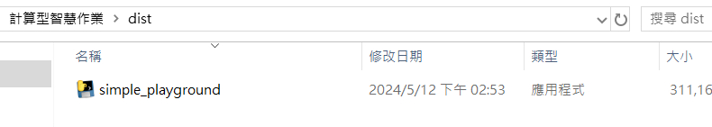
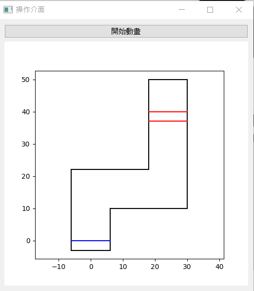
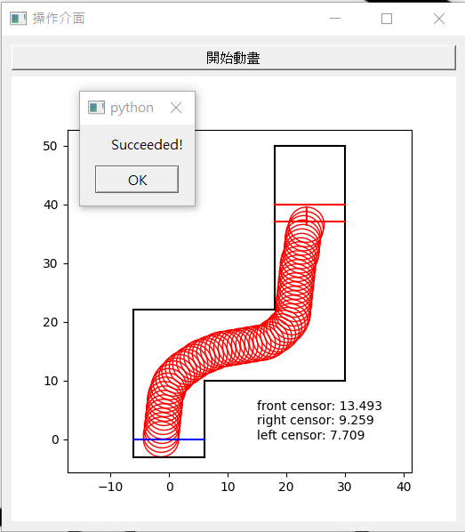
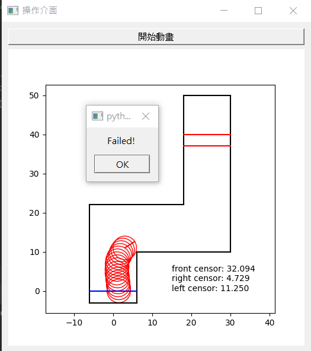
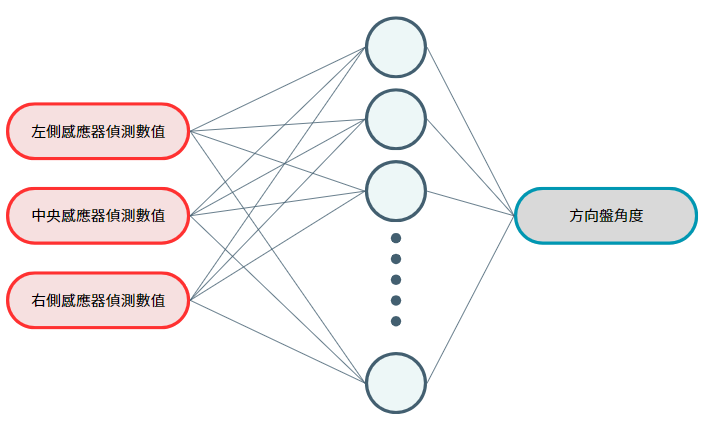
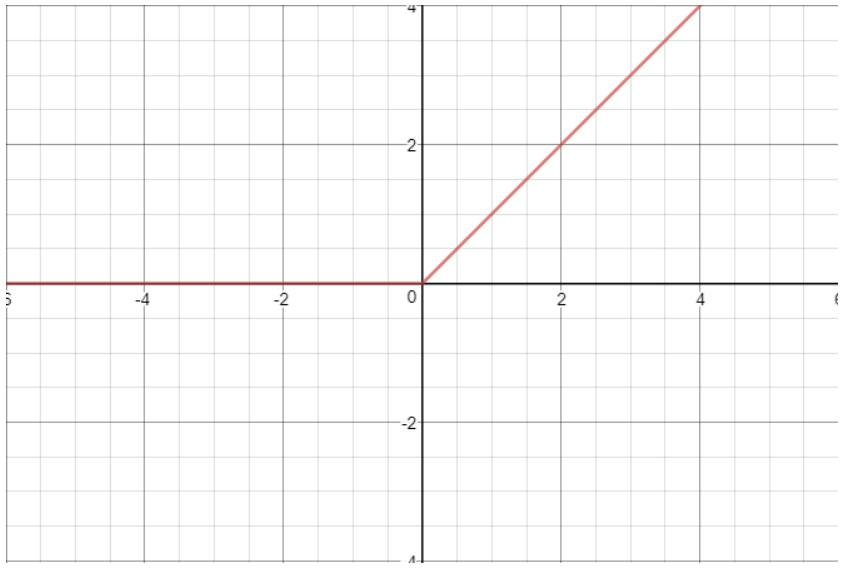
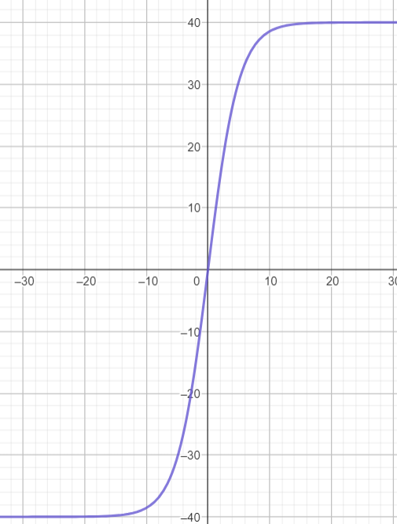
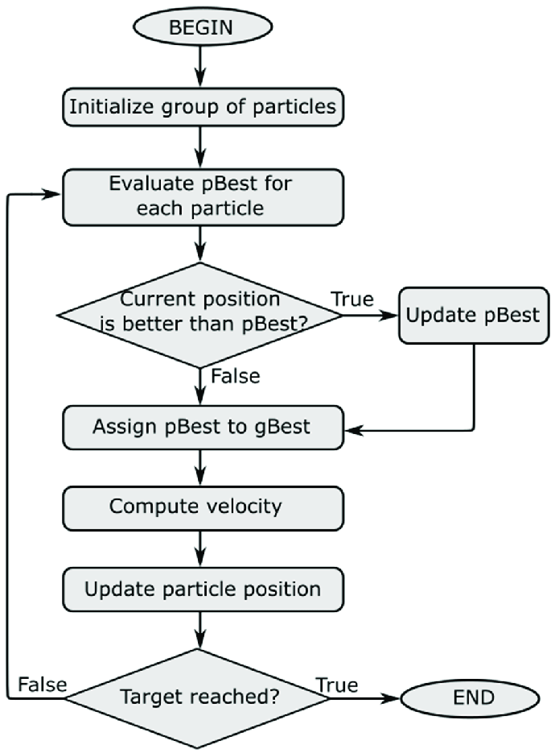

# 操作方法

開啟`executable file`中的`simple_playground.exe`


執行之後，出現下圖



點擊開始動畫後，就會自動訓練完畢後進行動畫

<br/>

以下是成功畫面



<br/>

以下是失敗畫面



# 簡介

透過PSO訓練MLP，來使得自走車可以依據3個感測器的值決定行走的方向。

# MLP 介紹

我建立了一個三層的MLP，其中包含：一個輸入層可以輸入三個感測器偵測的的距離，一個隱藏層，一個輸出層可以輸出當下的方向盤角度。
  


* 其中隱藏層的激活函數採用的是ReLu

(ReLu的函數) <br/>
$ReLu(x)=max(0, x)$



<br/>
* 而輸出層是修正後的tanh函數，使我們輸出的方向盤可以限縮於給定的範圍內 <br/>

$tanh(x)=40\times\frac{e^{x/5}-e^{-x/5}}{e^{x/5}+e^{-x/5}}$



# 演算法 - PSO



## particle 

每個particle包含以下的幾個元素<br/>
1. MLP中的權重函數 (視為PSO中每個粒子的$x\space vector$，即為當前位置)
2. 每次訓練時，自走車的軌跡 (用於計算適應度)
3. 前一次的訓練速度、當次的訓練速度

(這裡因為避免宣告過於多的`playground`在particle裡面造成運算和記憶體空間吃緊，所以particle會接收外面的`playground`後，把它reset後拿來訓練)


## 適應度函數

透過計算每個粒子執行的自走車移動軌跡的適應度，就可以決定哪個權重更適合此張圖片，也可以得到可以達到終點的權重。

$$\text{score(自走車的移動軌跡)} = (100 \text{ if 這個粒子的權重可以使自走車到達終點 else 0}) + \\
W_1 * (\text{最後自走車停止時的終點x值}) + \\
W_2 * (\text{最後自走車停止時的終點y值}) - \\
W_3 * (自走車的路徑長度) $$

我將$W_1$, $W_2$, $W_3$ 分別設為 0.8, 1, 0.5。

主要的想法是因為地圖是個倒z字型，因此最終自走車停止位置y值越大，就越接近終點。

同時，為了避免一開始就撞牆或是往左的結果影響，故設定為最終停止位置的x值越大也越好。但此時也需要考量過於往右方靠近，使得路線增加不必要的長度，因此減少其權重。

最後是為了讓自走車走一個最短的距離而設定，又為了避免一開始就撞牆的結果影響，所以權重設的特別小。

## 流程

```
 先確定粒子數k，並建立k個particle後，隨機初始化內部的權重矩陣

 // 適應度函數
 // 這裡函數因為是對每個粒子中所記錄的過往移動軌跡進行計算
 // 因此要先注意輸入
adaptive_func()

//歷史最佳的粒子座標
best_particle = None;

while (not 出現可達終點的權重)
    // 讓每個particle實際跑過一次playground，且每個particle會記錄下這次車子路徑
    for particle in particles
        particle run playground;
    end for

    for particle in particles
        // 若是歷史最佳，就將歷史最佳更新
        if adaptive_func(particle.route_histoy) > adaptive_func(best_particle.route_histoy) then
            best_particle = particle;
        end if
        
        // 紀錄鄰近最佳的粒子
        best_neighbor = particle;   //先將鄰近最佳的粒子更新為自己
        for neighbor in particles
            if addaptive_func(best_neighbor.route_histoy) > addaptive_func(neighbor.route_histoy) then
                best_neighbor = neighbor;
            end if
        end for
        
        // 決定每個粒子當下的速度，以及其移動的方位
        // 此處的m, n是自訂的權重 (m+n=1)
        paticle.v(t) = particle.v(t-1) + m*(besst_particle.weight - paticle.weight) + n*(besst_neighbor.weight - particle.weight) 

        // 此處和課本上的稍微不同的點是，我沒有給速度設限（因為這裡不好限制一個範圍）
        // 因此速度可能會出現很大的波動 (雖然結果來看是沒有太大的差異)

        particle.x(t) = particle.x(t-1) + particle(t-1)
    end for
```


## 注意事項


> [!NOTE]可精進之處
> 1. 適應度函數裡面的判斷方式還可以再修改，讓車子可以更滑順的過彎以增加成功率
> 2. 或是修改類神經網路裡面的激活函數等，來提升成功率。
> 

